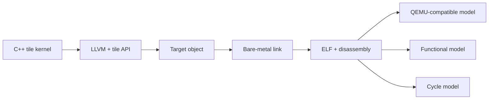

# From C++ Tile Kernel to NPU Execution

This workflow connects the source, compiler, benchmark harness, generated
binary, and execution model. Keep those stages separate so a failure has a
clear owner.



## 1. Produce a matching toolchain

Use `LinxISA/linx-toolchain-build` as the integration point. It selects the
LLVM branch, target headers, musl sysroot, runtime libraries, allocator, and
tile API as one build.

```console
git clone https://github.com/LinxISA/linx-toolchain-build.git
cd linx-toolchain-build
make init-src
make WITH_TARGET=linx64v5-linux-musl
export COMPILER_DIR="$PWD/output/linx_blockisa_llvm_musl/bin"
```

Only the `linx64v5-linux-musl` target is supported by the top-level build. The
current compiler line is LLVM 15 based and tracks branch `dev-llvm15_56`.

Verify the install as a unit:

```console
"$COMPILER_DIR/clang" --version
test -x "$COMPILER_DIR/clang++"
test -x "$COMPILER_DIR/ld.lld"
test -x "$COMPILER_DIR/llvm-objdump"
test -d "$(dirname "$COMPILER_DIR")/sysroot"
```

## 2. Select an active benchmark command

The one-level benchmark tree is organized by operator beneath
`benchmark/one-level-arch/test/kernel/`. Each active directory has a Makefile
and usually a `compile.all` manifest. The generated [benchmark
catalog](../benchmarks/index.md) expands those manifests into reproducible
commands and links each command to the reached source.

Start with an exact command from that catalog:

```console
cd benchmark/one-level-arch/test/kernel/matmul
make TESTCASE=matmul TYPE=MASK MODE=MASK_FP32 \
  M=256 N=256 K=256 tM=32 tN=32 tK=32
```

Current FlashAttention and matmul commands cap materialized tile storage at
4 KiB. A changed tile shape can compile through C++ templates yet violate the
active profile, so preserve the source assertions.

## 3. Understand the build harness

For `PLAT=linx`, `Makefile.common` selects:

| Tool | Resolved executable |
| --- | --- |
| C compiler | `$COMPILER_DIR/clang` |
| C++ compiler and linker | `$COMPILER_DIR/clang++` |
| Disassembler | `$COMPILER_DIR/llvm-objdump` |
| Object copier | `$COMPILER_DIR/llvm-objcopy` |

The target compile uses C++20, matrix support, block code generation, and tile
register lowering. Operator Makefiles add source-specific defines and data
objects. Build artifacts remain under `benchmark/one-level-arch/output/`.

Run `make -n ...` to inspect the full command without compiling.

## 4. Inspect generated operation blocks

Append `diss` to the same command:

```console
make TESTCASE=matmul TYPE=MASK MODE=MASK_FP32 \
  M=256 N=256 K=256 tM=32 tN=32 tK=32 diss
```

Read the `.diss` file next to the ELF. Tile-operation blocks should preserve
the source dataflow: loads create operand tile versions, matrix or vector
operations consume those versions, and stores consume the final result.
Scheduling may reorder independent tile IDs.

## 5. Execute the ELF

The Makefile's `sim` target accepts a QEMU-compatible block model explicitly:

```console
make TESTCASE=matmul TYPE=MASK MODE=MASK_FP32 \
  M=256 N=256 K=256 tM=32 tN=32 tK=32 \
  sim QEMU=/path/to/qemu-linx
```

The current functional and cycle models can also consume the same ELF:

```console
bin/gfrun -f /path/to/kernel.elf
bin/gfsim -f /path/to/kernel.elf
```

Use `-s core.singleTierMode=true` with `gfsim` for pure tile-operation kernels
that execute on the VectorLite path.

## 6. Scale verification deliberately

1. Run `make -n` to verify path and option expansion.
2. Compile one representative case.
3. Generate and inspect disassembly.
4. Run a functional model with known data.
5. Run the cycle model only after correctness is established.
6. Use `./compile_all.sh one-level` for the full active suite.

For documentation changes, use the standalone site gate:

```console
python3 -m pip install -r docs/requirements.txt
docs/build.sh
```

## Failure ownership

| Failure | Likely owner |
| --- | --- |
| Missing compiler executable | toolchain installation or `COMPILER_DIR` |
| C++ type/shape diagnostic | kernel source or tile API contract |
| Backend assertion | compiler lowering and selected tile shape |
| Missing symbol or relocation | sysroot, startup objects, or link mode |
| Model rejects ELF | target/model revision mismatch |
| Wrong tensor result | kernel algorithm, data generation, or model semantics |
| Cycle-model deadlock | execution mode or unsupported engine path |

Record the compiler revision, exact catalog command, ELF path, and model
revision in bug reports. Those four values make failures reproducible without
capturing a developer's local directory layout.
