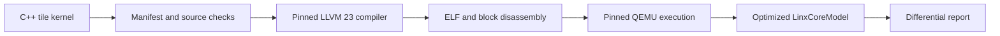

# From C++ Tile Kernel to Model Execution

The supported workflow is a staged contract, not a single compiler command.
It keeps the programming interface, ISA mapping, compiler output, functional
execution, and cycle-model behavior independently diagnosable.



## Sources of truth

| Contract | Authoritative source |
| --- | --- |
| Active ISA profile | `isa/v0.57/linxisa-v0.57.json` |
| Tile operation inventory | `isa/v0.57/state/pto_ops.json` |
| Tile-to-encoding map | `isa/v0.57/state/pto_encoding_map.json` |
| Compiler | `compiler/llvm` submodule pin |
| Functional execution | `emulator/qemu` submodule pin |
| Final cycle target | `tools/LinxCoreModel` submodule pin |
| Benchmark cases | SuperNPUBench `compile.all` manifests |

The public C++ reference contains the same 111 operations as the v0.57 tile
inventory plus `get_thread_idx()` and `get_block_idx()`. `TTRANS` remains the
C++ API name; its encoding map records the architectural `TTRANSPOSE`
identity. That mapping is deliberate, not an additional public intrinsic.

## 1. Pin the complete workspace

Clone the superproject recursively and update exactly to its reviewed pins:

```console
git clone --recurse-submodules https://github.com/LinxISA/linx-isa.git
cd linx-isa
git submodule sync --recursive
git submodule update --init --recursive
export LINX_ROOT="$PWD"
```

Do not advance one submodule independently for a publication build. A compiler
or model result is meaningful only when its source pin is recorded by the
superproject.

## 2. Validate the ISA and tile catalog

```console
python3 tools/isa/build_golden.py --profile v0.57 --check
python3 tools/isa/validate_spec.py --profile v0.57
python3 tools/isa/check_canonical_v057.py --root "$LINX_ROOT"
python3 tools/isa/check_pto_v057_manifest.py --root "$LINX_ROOT"
```

These checks reject retired spellings, holes in selector families, and drift
between the 111-operation inventory and its encoding map.

## 3. Build and identify the compiler

```console
cmake -S compiler/llvm/llvm -B compiler/llvm/build-linxisa-clang -G Ninja \
  -DCMAKE_BUILD_TYPE=Release \
  -DLLVM_ENABLE_PROJECTS="clang;lld" \
  -DLLVM_EXPERIMENTAL_TARGETS_TO_BUILD=LinxISA \
  -DLLVM_TARGETS_TO_BUILD=""

cmake --build compiler/llvm/build-linxisa-clang \
  --target clang lld llvm-objdump llvm-objcopy llvm-readobj -j 12

export COMPILER_DIR="$LINX_ROOT/compiler/llvm/build-linxisa-clang/bin"
"$COMPILER_DIR/clang" --version
```

The version output must identify the compiler source currently pinned by the
superproject. Rebuild Clang after a compiler pin changes; a successful command
from an older binary is provenance evidence, not current validation.

## 4. Compile a bounded case

For a direct compiler check:

```console
cd "$LINX_ROOT/workloads/SuperNPUBench/benchmark/two-level-arch/test/tileop_api"
make TESTCASE=TAdd PLAT=linx COMPILER_DIR="$COMPILER_DIR"
make TESTCASE=TLoad PLAT=linx COMPILER_DIR="$COMPILER_DIR"
```

For the public one-level benchmark catalog, reproduce the complete command
shown on the benchmark page. Build commands are generated from active manifest
rows, so documentation regeneration incorporates case additions, removals, and
renames automatically.

## 5. Inspect the ELF before execution

Use the `llvm-objdump` from the same compiler build:

```console
"$COMPILER_DIR/llvm-objdump" -dr --section-headers /path/to/kernel.elf
```

Confirm that tile operations lower to the expected block templates and that
the ELF target, entry point, sections, and relocations match the selected
direct-boot lane.

## 6. Run QEMU before the cycle model

Create a clean QEMU build matched to the pinned source:

```console
cd "$LINX_ROOT"
export QEMU="$(tools/bringup/run_qemu_build_clean.sh)"
```

Then use the canonical workload runner:

```console
python3 tools/bringup/run_ai_workload_flow.py \
  --profile smoke \
  --kind supernpu \
  --case '=supernpu-tileop_api-TAdd' \
  --run-id supernpu-tadd
```

The runner stops on the first failed hard-break stage. It never promotes a
compiler-failing ELF to QEMU or a QEMU-failing ELF to LinxCoreModel.

## 7. Interpret model evidence

The final execution command is plain `gfsim -f <elf>`. Artificial cycle limits
do not turn an incomplete run into a pass. On failure, preserve the report,
QEMU log, model log, last block-program-counter progress, finisher status, and
focused disassembly window before assigning ownership.

Artifacts are written to:

```text
workloads/generated/<run-id>/ai-bringup/
```

Use `summary.md` for the first-failure owner and `report.json` for exact command
and path provenance.

## Failure ownership

| First failing stage | Initial owner |
| --- | --- |
| Missing source or stale manifest | benchmark |
| Rejected C++ or invalid object/ELF | compiler or benchmark contract |
| Compiler-passing ELF fails QEMU | emulator or architectural contract |
| QEMU-passing ELF fails `gfsim` | model |
| Both execute but results differ | kernel algorithm or cross-model semantics |

Escalate only after preserving the first wrong artifact. Later-stage symptoms
are not evidence that an earlier stage caused the failure.
